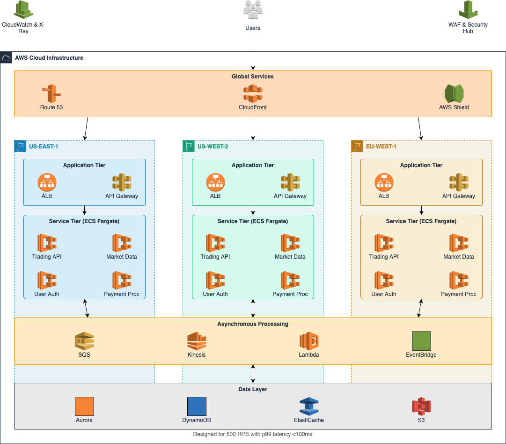

## Task 2: Building Castle In The Cloud

#### Architecture Diagram Overview

#### Key Components

1. **Multi-Region Deployment**
   - Primary regions: us-east-1, us-west-2, eu-west-1
   - Why: Reduced latency, fault tolerance, and compliance with regional data regulations
   - Alternatives: Single region with multiple AZs

2. **Amazon Route 53**
   - Role: Global DNS and health checking for region failover
   - Why: Low latency DNS resolution with automatic failover capabilities
   - Alternatives: Third-party DNS services

3. **Amazon CloudFront**
   - Role: CDN for static content (web UI, market data)
   - Why: Reduced latency for static assets, DDoS protection
   - Alternatives: Third-party CDNs like Cloudflare

4. **Application Load Balancers**
   - Role: Distribute traffic to application services
   - Why: Layer 7 routing, support for WebSockets (real-time price updates)
   - Alternatives: Network Load Balancer

5. **Amazon ECS with Fargate**
   - Role: Container orchestration for microservices
   - Why: Serverless containers reduce operational overhead
   - Alternatives: Kubernetes/EKS

6. **Core Microservices**
   - Trading API: Handles order placement, cancellations
   - Market Data Service: Real-time price feeds, order book data
   - User Authentication: Manages user sessions, 2FA
   - Payment Processing: Handles deposits/withdrawals

7. **Database Layer**
   - Amazon Aurora: Primary database for transaction history, order data
   - DynamoDB: User profiles, fast lookups, account balances
   - ElastiCache (Redis): Market data, session data, rate limiting
   - Why: Mix of SQL and NoSQL for performance optimization
   - Alternatives: MongoDB, PostgreSQL

8. **Amazon SQS & Lambda**
   - Role: Asynchronous processing for order matching and execution
   - Why: Decouples order intake from execution, provides buffer during spikes
   - Alternatives: Apache Kafka

9. **CloudWatch & X-Ray**
   - Role: Monitoring, alerting, distributed tracing
   - Why: Immediate visibility into performance and issues
   - Alternatives: Datadog, New Relic

#### Scaling Strategy
   - Auto-scaling groups for ECS tasks based on CPU/memory metrics
   - DynamoDB on-demand capacity for unpredictable workloads
   - ElastiCache cluster with replicas for read-heavy workloads
